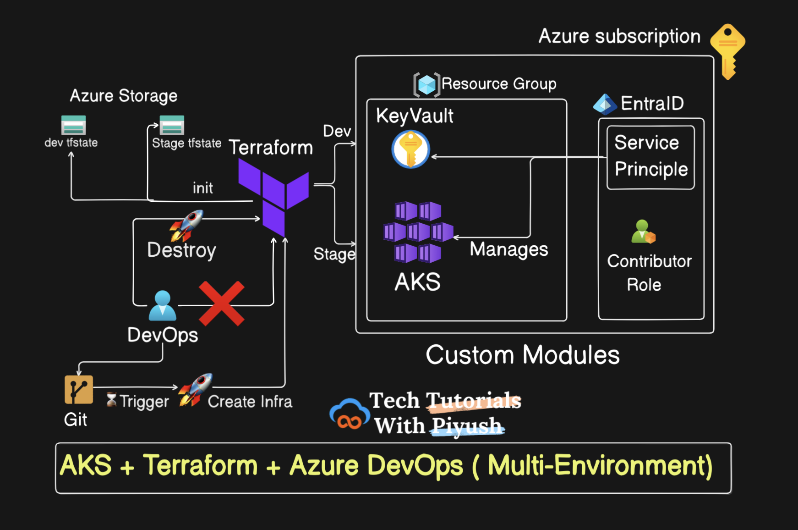

# Azure Terraform Infrastructure

Practice project for provisioning Azure infrastructure with Terraform and automating deployments through Azure DevOps.

Repository: [abhi002shek/azure-terraform-infra](https://github.com/abhi002shek/azure-terraform-infra)

## Architecture



Each environment (`dev`, `staging`) deploys the same stack into isolated resource groups with separate Terraform state backends.

## What gets created

| Resource | Module / file | Purpose |
|----------|---------------|---------|
| Resource group | `dev/main.tf`, `staging/main.tf` | Holds all environment resources |
| Azure AD app + service principal | `modules/ServicePrincipal` | Identity for AKS and automation |
| Subscription Contributor role | `azurerm_role_assignment` | Grants SP permissions on the subscription |
| Key Vault (Premium, RBAC) | `modules/keyvault` | Stores the service principal secret |
| Key Vault secret | `azurerm_key_vault_secret` | SP client ID stored as secret name, secret value as password |
| AKS cluster | `modules/aks` | Kubernetes cluster with autoscaling node pool |
| Local kubeconfig file | `local_file` | Writes cluster config to `./kubeconfig` (gitignored) |

**Region:** `canadacentral` (default)

## Repository layout

```
.
├── dev/                    # Dev environment root module
│   ├── main.tf
│   ├── variables.tf
│   ├── backend.tf          # Remote state → tfdevbackend2024piyush
│   └── terraform.tfvars    # Environment-specific values
├── staging/                # Staging environment root module
│   ├── main.tf
│   ├── variables.tf
│   ├── backend.tf
│   └── terraform.tfvars
├── modules/
│   ├── ServicePrincipal/
│   ├── keyvault/
│   └── aks/
├── pipeline/
│   ├── create.yaml         # CI/CD: validate → dev → staging
│   └── destroy.yaml        # Manual destroy (dev or staging)
├── scripts/
│   └── dev.sh              # Bootstrap remote state storage accounts
├── provider.tf             # Legacy root provider block (not used by env folders)
└── output.tf               # Legacy root outputs (not used by env folders)
```

## Prerequisites

- [Azure CLI](https://learn.microsoft.com/en-us/cli/azure/install-azure-cli) (`az login`)
- [Terraform](https://developer.hashicorp.com/terraform/install) **>= 1.9.0** (required by `provider.tf`)
- Permissions to create resource groups, AKS, Key Vault, and Azure AD applications
- An SSH public key at `modules/aks/.ssh/id_rsa.pub` (or update `ssh_public_key` in the AKS module)

## Bootstrap remote state (one time)

Before first `terraform init`, create the state storage accounts:

```bash
chmod +x scripts/dev.sh
./scripts/dev.sh
```

This creates:

- Resource group: `terraform-state-rg`
- Dev storage account: `tfdevbackend2024piyush`
- Staging storage account: `tfstagebackend2024piyush`
- Blob container: `tfstate` (in each account)

## Local usage

1. Set your subscription ID in `dev/terraform.tfvars` and `staging/terraform.tfvars`:

   ```hcl
   SUB_ID = "your-subscription-id"
   ```

2. Generate an SSH key for AKS (if you do not already have one):

   ```bash
   mkdir -p modules/aks/.ssh
   ssh-keygen -t rsa -b 4096 -f modules/aks/.ssh/id_rsa -N ""
   ```

3. Deploy dev:

   ```bash
   cd dev
   terraform init
   terraform plan
   terraform apply
   ```

4. Repeat from `staging/` for the staging environment.

## Azure DevOps pipeline setup

Point your pipeline YAML path to `pipeline/create.yaml` (or `pipeline/destroy.yaml` for teardown).

### 1. Service connection

Create an Azure Resource Manager service connection named **`Azure-Service-Connection`** with access to your subscription.

### 2. Variable group

Create a variable group named **`terraform-secrets`** (referenced in both pipeline files). Add any secrets you pass via `TF_VAR_*` or pipeline variables. Do not commit secrets to git.

### 3. Environments

Create Azure DevOps **environments** with approvals if desired:

- `dev`
- `staging`

The destroy pipeline uses the same environment names for manual approval gates.

### 4. Pipeline behaviour

| Pipeline | Trigger | Stages |
|----------|---------|--------|
| `create.yaml` | `main`, `feature/*` on infra path changes | Validate → Dev apply (main only) → Staging apply (main only) |
| `destroy.yaml` | Manual only | Plan destroy → Destroy (parameter: `dev` or `staging`) |

**Note:** `apply` runs without an explicit `plan` + approval step in CI. For production-style workflows, add a plan stage and use `command: plan` with artifact publishing before apply.

## Issues and recommendations (practice notes)

These are common learning gaps in the current code — fine for a lab, worth fixing as you grow:

1. **Empty `SUB_ID`** — Role assignment will fail until you set the subscription ID in `terraform.tfvars`.
2. **Key Vault RBAC without assignments** — `enable_rbac_authorization = true` but no `azurerm_role_assignment` grants your user or SP access to write secrets. Add Key Vault Secrets Officer (or equivalent) for the deploying identity.
3. **Service principal on AKS** — `service_principal` block is legacy; Azure recommends [managed identity](https://learn.microsoft.com/en-us/azure/aks/use-managed-identity) for AKS.
4. **Broad Contributor on subscription** — Works for labs; in real projects scope roles to the resource group only.
5. **Secrets in Terraform state** — Client secrets and kubeconfig end up in state; treat state storage as highly sensitive.
6. **Root `provider.tf` / `output.tf`** — Not wired into `dev/` or `staging/`; safe to delete later to reduce confusion.
7. **Duplicate `provider` blocks** — `dev/backend.tf` and `staging/backend.tf` also declare `provider "azurerm"`; consolidate into one file per environment.
8. **Naming** — Resource names still use `piyush`; rename in `terraform.tfvars` to your own prefix for clarity.
9. **Cost** — AKS + Premium Key Vault + autoscaling nodes incur ongoing charges; destroy when not in use via `pipeline/destroy.yaml` or `terraform destroy`.

## Terraform providers

| Provider | Version constraint |
|----------|-------------------|
| `hashicorp/azurerm` | `~> 4.12.0` |
| `hashicorp/azuread` | `~> 3.0.2` |

## License

Personal practice project — use and modify freely for learning.
